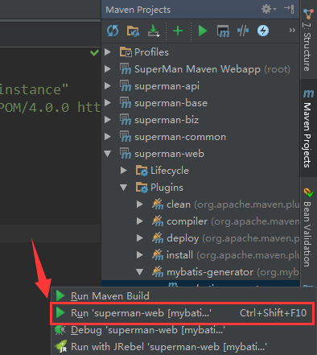
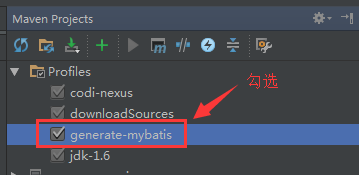

## IDEA 

### mybatis plugin
KEY:
`305c300d06092a864886f70d0101010500034b003048024100878e6bea07d7052499419efe4ed4382f426dc5ca2d01140f896a6d0566526c6757ff591347d888bd032f94ce92609ce0cc349de0ba9043dc3163f9667438a14d0203010001`
RESULT:
`414834456369b9329793f0b42c6c0af67d00516c7ceb136ad221fa0355dc2cd611ed1bcd36b61d00ba7e587d253c1de145831cd0d65b891c9dc34430f9e69c59`

- 安装官方版mybatis plus插件,然后关闭IDEA
- hosts中添加127.0.0.1 www.codesmagic.com
- 记事本打开C:\Users\{USER}\.IntelliJIdea{VERSION}\config\options\mybatis.xml，写入到对应的字段中，打开idea，mybatis插件已经激活
- `Run As MyBatis generatorConfig.xml`(不支持plugin)

### Maven Jar依赖方式（推荐使用）
- 用下面这种方式运行支持plugin

